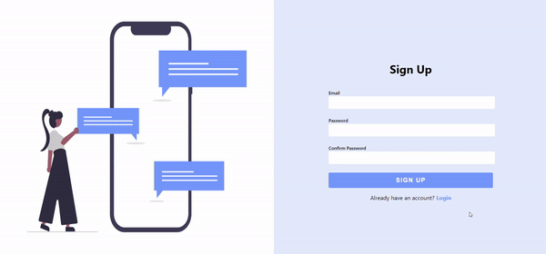
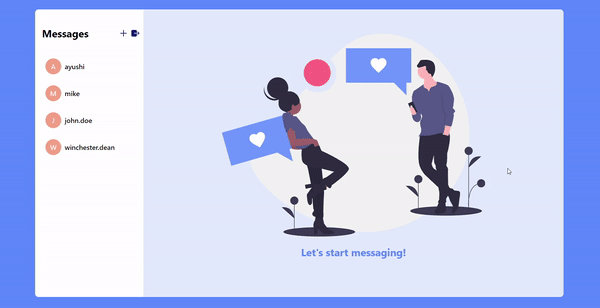
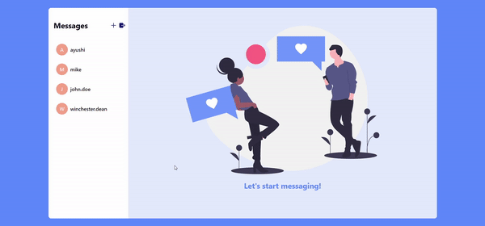

# Chat App
A basic Chat App made using Firestore.

## Demo

 

 

 
 

## Technologies used

In the project directory, you can run:

It runs the app in the development mode. 
Open [http://localhost:3000](http://localhost:3000) to view it in the browser.

